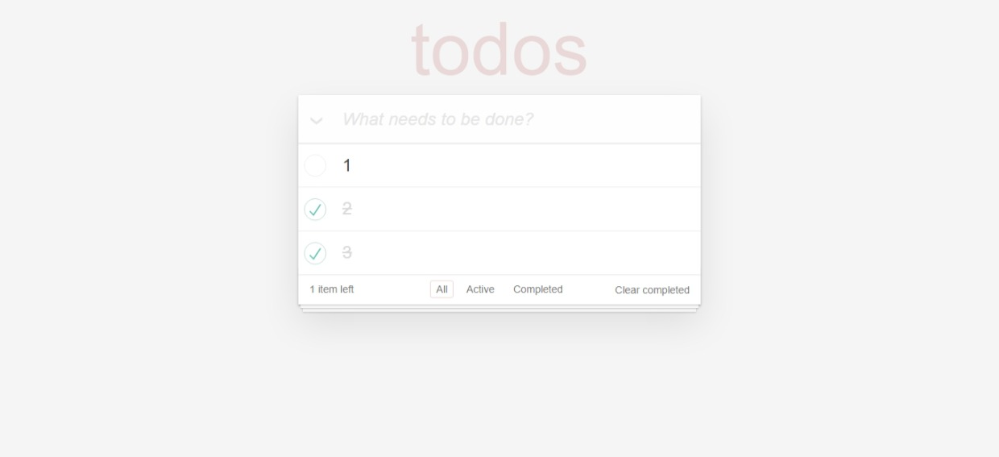

# TODOS
[TOC]

## 技术👵

[](https://github.com/Vogadero/memo)+++++++++

## 截图👳‍♂️



## 功能🎅

| 功能               |
| ------------------ |
| 展示任务列表       |
| 添加每日任务       |
| 删除任务           |
| 更改任务状态       |
| 修改任务名称       |
| 计算未完成任务数量 |
| 显示未完成任务     |
| 清除已完成任务     |

## 介绍👩‍🎓

### 展示任务列表

1. 准备一个放置任务列表的数组
2. 向服务器端发送请求，获取已存在的任务
3. 将已存在的任务存储在任务列表数组中
4. 通过模板引擎将任务列表数组中的任务显示在页面中


### 添加每日任务

1. 为文本框绑定键盘抬起事件，在事件处理函数中判断当前用户敲击的是否是回车键
2. 当用户敲击回车键的时候，判断用户在文本框中是否输入了任务名称
3. 向服务器端发送请求，将用户输入的任务名称添加到数据库中，同时将任务添加到任务数组中
4. 通过模板引擎将任务列表数组中的任务显示在页面中


### 删除任务

1. 为删除按钮添加点击事件（因为li是动态的，所以利用事件委托，将事件绑定在ul标签上，当用户点击li里的删除按钮时，由于事件具有冒泡特性，事件会一层一层向上传递，当传递到ul标签时就能触发它身上的点击事件）
2. 在事件处理函数中获取到要删任务的id
3. 向服务器端发送请求，根据ID删除任务，同时将任务数组中的相同任务删除
4. 通过模板引擎将任务列表数组中的任务重新显示在页面中


### 更改任务状态

1. 为任务复选框添加onchange事件
2. 在事件处理函数中获取复选框是否选中
3. 向服务器端发送请求，将当前复选框的是否选中状态提交到服务器端
4. 将任务状态同时也更新到任务列表数组中
5. 通过模板引擎将任务列表数组中的任务重新显示在页面中并且根据任务是否完成为li元素添加completed类名


### 修改任务名称

1. 为任务名称外层的label标签添加双击事件，同时为当前任务外层的li标签添加editing类名，开启编辑状态
2. 将任务名称显示在文本框中并让文本框获取焦点
3. 当文本框离开焦点时，将用户在文本框中输入值提交到服务器端，并将最新的任务名称更新到任务列表数组中
4. 使用模板引擎重新渲染页面中的任务列表


### 计算未完成任务数量

1. 准备一个用于存储未完成任务数量的变量
2. 将未完成任务从任务数组中过滤出来
3. 将过滤结果数组的长度赋值给任务数量变量
4. 将结果更新到页面中


### 显示未完成任务

1. 为active按钮添加点击事件
2. 从任务列表数组中将未完成任务过滤出来
3. 使用模板引擎将过滤结果显示在页面中


### 清除已完成任务

1. 为clear completed按钮添加点击事件
2. 向服务器端发送请求将数据库中的已完成任务删除掉
3. 将任务列表中的已完成任务删除调用
4. 使用模板引擎将任务列表中的最后结果显示在页面中


## Tree🌵   

```
toDos
├─ api.http
├─ data.json
├─ day04-参考答案.md
├─ day04.md
├─ index.js
├─ package-lock.json
├─ package.json
├─ public
│  ├─ css
│  │  ├─ base.css
│  │  └─ index.css
│  ├─ js
│  │  ├─ axios.js
│  │  └─ vue.js
│  └─ toDos.html
├─ router.js
├─ service.js
└─ 接口文档.md
```